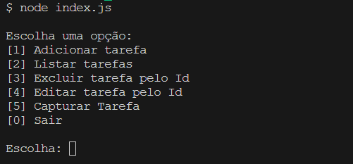

<h1 align="center">Lista de tarefas</h1>

  

---

## 💻 Projeto

O projeto consiste na criação de uma aplicação JavaScript capaz de criar novas tarefas, editar, excluir e gerenciar suas tarefas. Foi utilizado os conceitos de funções, condicionais, array, trycatch, métodos e tratamento de erros.

---

### 1. Clonando o repositório

```
git clone https://github.com/eomgn/list-taks
```

### 2. Instalando as dependências

```
npm install
```

### 🎮 Rodando o projeto

```
1. Após instalar as dependencias abra o terminal da sua IDE.
```

```
2. Inicie o projeto com o comando CLI:
node index.js
```

```
3. Após o comando acima você vai observar na sua IDE que o projeto inicou pois irá
aparecer um menu para gerenciar suas tarefas.
```

```
4. Faça bom uso! 😁.
```

---

## ♾️ Time

O projeto foi desenvolvido em grupo por:

-   [Matheus Gabriel Nogueira](https://github.com/eomgn)
-   [Gabriella Freitas de Sena](https://github.com/GabriellaFsena)
-   [Karisma Souza](https://github.com/karismasousa)
-   [Lucas de Grande](https://github.com/lucasdegrande_)
